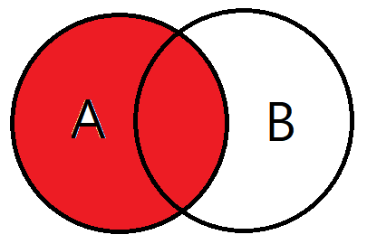
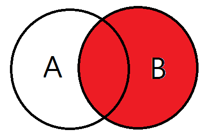
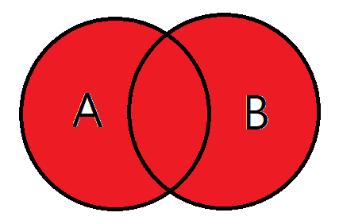
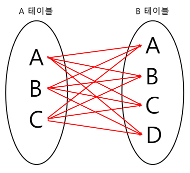
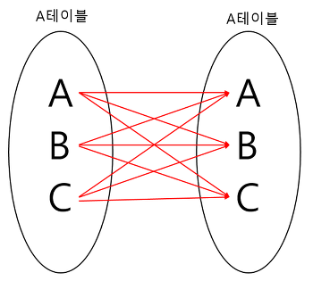

    SELECT * 
    FROM buyTBL
        INNER JOIN userTBL
            ON buyTBL.userID = userTBL.userID; << 중복되는 열을 합침

    SELECT buyTBL.userID, userTBL.userName, buyTBL.prodName, userTBL.addr, 
            CONCAT(userTBL.mobile1,userTBL.mobile2)  AS '연락처'
    FROM buyTBL
        INNER JOIN userTBL
            ON buyTBL.userID = userTBL.userID;

# LEFT OUTER JOIN

# RIGHT OUTER JOIN

# FULL OUTER JOIN

# CROSS JOIN

# SELF JOIN
